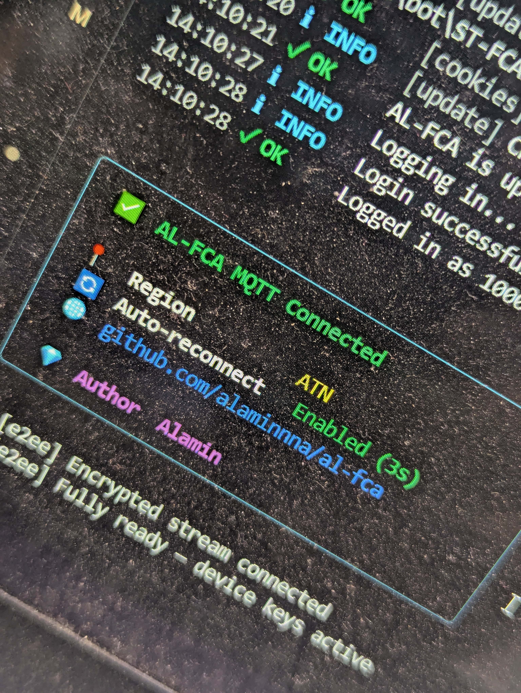

<div align="center">


<br/>

[](https://www.npmjs.com/package/al-fca)
[](https://www.npmjs.com/package/al-fca)
[](./LICENSE)
[](https://nodejs.org/)
[](#-e2ee-end-to-end-encryption)

**Interact with Facebook Messenger programmatically. Built for bot developers.**

🔐 Now with End-to-End Encryption (E2EE) — Signal Protocol + Noise, pure JavaScript, no native binary.

[Installation](#-installation) • [Quick Start](#-basic-usage) • [E2EE Guide](./E2EE_GUIDE.md) • [npm](https://www.npmjs.com/package/al-fca) • [Issues](https://github.com/alaminnna/al-fca/issues)

</div>

---

> I maintain this to keep Messenger bot building simple in Node.js. Small win by small win — auto-update, clearer logs, and encrypted chats when you need them. — Al A Min

**AL-FCA (al-fca)** is an unofficial Facebook Chat API for Node.js with auto-update and E2EE support. It emulates a browser session to automate chat on a user account.

**Keywords:** facebook chat api nodejs, messenger bot api, unofficial facebook messenger api, mqtt chatbot, al-fca e2ee, signal protocol messenger nodejs, alaminnna

<details>
<summary>📑 Table of Contents (click to expand)</summary>

- [What's New](#-whats-new-in-al-fca)
- [Installation](#-installation)
- [Auto-Update](#-auto-update-feature)
- [Basic Usage](#-basic-usage)
- [E2EE Encryption](#-e2ee-end-to-end-encryption)
- [Message Types](#-message-types)
- [AppState](#-saving-appstate-to-avoid-re-login)
- [Listening](#-listening-for-messages)
- [Author — Al A Min (Alaminnna)](#-author--al-a-min-alaminnna)

</details>

<div align="center">

</div>

## 🌟 What's New in AL-FCA

- ✨ Enhanced MQTT connection logging
- 🔄 Auto-reconnect with configurable intervals
- 📊 Better connection status indicators
- 🎨 Improved console output with colors
- 🔐 **End-to-End Encryption (E2EE) Support** - Messenger encrypted chats powered by FB-Messenger-E2EE (Signal Protocol + Noise, pure JavaScript — no native binary)
- 🚀 Automatic update checking and installation
- 💡 Better error handling and debugging
- 🔐 Enhanced security and stability

## 📦 Installation

```bash
npm install al-fca
```

Or with yarn:

```bash
yarn add al-fca
```

## 🔄 Auto-Update Feature

AL-FCA includes an **automatic update system** that keeps your package up-to-date seamlessly:

### How It Works

1. 🔍 **Automatic Check**: Checks for updates when you start your bot
2. 📋 **Shows Changes**: Displays recent changelog updates
3. 📦 **NPM Update**: Runs `npm install al-fca@latest` automatically
4. 🔄 **Auto-Restart**: Restarts your bot to apply changes

### For Bot Projects

If you're using AL-FCA in your bot project (like [AL-FCA](https://github.com/alaminnna/AL-FCA)), the package will:

- ✅ Detect when a new version is available
- ✅ Automatically update to the latest version via npm
- ✅ Update your `node_modules/al-fca` folder
- ✅ Restart your bot with the new version

### Manual Update

You can also update manually:

```bash
npm install al-fca@latest
```

Or check for updates programmatically:

```javascript
const { checkForFCAUpdate } = require('al-fca/checkUpdate.js');
await checkForFCAUpdate();
```

### Update Notifications

The auto-update system will:
- Show the current and latest versions
- Display recent changes from the changelog
- Inform you when the update is complete
- Automatically restart your application

**Note**: Updates are non-blocking and won't interrupt your bot's startup if the update check fails.

## ⚠️ Important Disclaimer

**We are not responsible if your account gets banned for spammy activities such as:**

- Sending lots of messages to people you don't know
- Sending messages very quickly
- Sending spammy looking URLs
- Logging in and out very quickly

**Recommendation:** Use Firefox browser or [this website](https://fca.dongdev.id.vn) to reduce logout issues, especially for iOS users.

**Support:** If you encounter errors, contact us [here](https://www.facebook.com/mdong.dev)

## 🔍 Introduction

Facebook now has an [official API for chat bots](https://developers.facebook.com/docs/messenger-platform), however it's only available for Facebook Pages.

`al-fca` is the only API that allows you to automate chat functionalities on a **user account** by emulating the browser. This means:

- Making the exact same GET/POST requests as a browser
- Does not work with auth tokens
- Requires Facebook account credentials (email/password) or AppState

## 📦 Installation

```bash
npm install al-fca@latest
```

## 🚀 Basic Usage

### 1. Login and Simple Echo Bot

```javascript
const login = require("al-fca");

login({ appState: [] }, (err, api) => {
    if (err) return console.error(err);

    api.listenMqtt((err, event) => {
        if (err) return console.error(err);

        // Echo back the received message
        api.sendMessage(event.body, event.threadID);
    });
});
```

### 2. Send Text Message

```javascript
const login = require("al-fca");

login({ appState: [] }, (err, api) => {
    if (err) {
        console.error("Login Error:", err);
        return;
    }

    let yourID = "000000000000000"; // Replace with actual Facebook ID
    let msg = "Hey!";

    api.sendMessage(msg, yourID, err => {
        if (err) console.error("Message Sending Error:", err);
        else console.log("Message sent successfully!");
    });
});
```

**Tip:** To find your Facebook ID, look inside the cookies under the name `c_user`

### 3. Send File/Image

```javascript
const login = require("al-fca");
const fs = require("fs");

login({ appState: [] }, (err, api) => {
    if (err) {
        console.error("Login Error:", err);
        return;
    }

    let yourID = "000000000000000";
    let imagePath = __dirname + "/image.jpg";

    // Check if file exists
    if (!fs.existsSync(imagePath)) {
        console.error("Error: Image file not found!");
        return;
    }

    let msg = {
        body: "Hey!",
        attachment: fs.createReadStream(imagePath)
    };

    api.sendMessage(msg, yourID, err => {
        if (err) console.error("Message Sending Error:", err);
        else console.log("Message sent successfully!");
    });
});
```

## 🔐 E2EE (End-to-End Encryption)

AL-FCA includes **End-to-End Encryption support** for secure encrypted messaging,
powered by [FB-Messenger-E2EE](https://github.com/HerokeyVN/FB-Messenger-E2EE)
(Signal Protocol + Noise transport, pure JavaScript — no native binary required).

Device keys persist at `.al-fca-e2ee/device.json` (created on first E2EE connect).
Keep that file to stay the same registered E2EE device across restarts.

### What is E2EE?

E2EE (End-to-End Encryption) ensures that messages are encrypted on the sender's device and only decrypted on the recipient's device. No one in between (including servers) can read your messages.

### E2EE Features

✅ **Encrypted Messages** - All messages are encrypted  
✅ **Encrypted Attachments** - Photos, videos, files encrypted  
✅ **Automatic Detection** - Auto-routes between E2EE and standard messages  
✅ **Message Reactions** - React to encrypted messages  
✅ **Message Editing** - Edit encrypted messages  
✅ **Typing Indicators** - Send typing indicators over E2EE  
✅ **Device Persistence** - Reuse device keys across sessions  
✅ **Media Server** - Local cache for decrypted files  

### E2EE Quick Start

```javascript
const login = require("al-fca");
const fs = require("fs");

login(
    { appState: JSON.parse(fs.readFileSync("appstate.json", "utf8")) },
    {
        enableE2EE: true,  // 🔐 Enable E2EE
        listenEvents: true,
        autoMarkRead: true
    },
    (err, api) => {
        if (err) return console.error(err);

        // Connect E2EE Bridge
        api.connectE2EE((err) => {
            if (err) console.error("E2EE connection failed:", err);
            console.log("✓ E2EE connected!");
        });

        // Get device data
        api.getE2EEDeviceData((err, data) => {
            if (!err) console.log("✓ Device data loaded");
        });

        // Listen for E2EE Messages
        api.listenMqtt((err, event) => {
            if (err) return console.error(err);

            // Handle E2EE messages
            if (event.type === "e2ee_message") {
                console.log("🔐 E2EE Message:", event.body);
                console.log("   Thread:", event.threadID);
                console.log("   Encrypted: ✓ YES");

                // Auto-reply with E2EE
                api.sendMessage("Received: " + event.body, event.threadID);
            }

            // Handle E2EE reactions
            if (event.type === "e2ee_message_reaction") {
                console.log("🔐 E2EE Reaction:", event.reaction);
            }

            // Handle E2EE edits
            if (event.type === "e2ee_message_edit") {
                console.log("🔐 E2EE Message Edited:", event.body);
            }
        });
    }
);
```

### E2EE Event Types

#### E2EE Message Event
```javascript
event.type === "e2ee_message"
{
    type: "e2ee_message",
    senderID: "61568577897207",
    threadID: "61568577897207:69@msgr",  // E2EE JID format
    body: "Hello encrypted world!",
    messageID: "m_1234567890",
    isE2EE: true,  // 🔐 Marked as encrypted
    isGroup: false,
    timestamp: 1780805668000,
    attachments: [],
    mentions: {}
}
```

#### E2EE Reaction Event
```javascript
event.type === "e2ee_message_reaction"
{
    type: "e2ee_message_reaction",
    messageID: "m_1234567890",
    reaction: "❤️",
    userID: "61568577897207",
    threadID: "61568577897207:69@msgr",
    isE2EE: true
}
```

#### E2EE Message Edit Event
```javascript
event.type === "e2ee_message_edit"
{
    type: "e2ee_message_edit",
    messageID: "m_1234567890",
    body: "Updated encrypted message",
    senderID: "61568577897207",
    isE2EE: true
}
```

### E2EE API Methods

```javascript
// Enable E2EE in options
api.setOptions({ enableE2EE: true });

// Connect E2EE bridge
api.connectE2EE(callback);

// Get device encryption keys
api.getE2EEDeviceData(callback);

// Send encrypted message (auto-detected)
api.sendMessage(message, e2eeThreadID, callback);

// React to encrypted message
api.setMessageReaction(emoji, messageID, callback);

// Edit encrypted message
api.editMessage(message, messageID, callback);

// Unsend encrypted message
api.unsendMessage(messageID, callback);

// Send typing indicator (E2EE)
api.sendTypingE2EE(threadID, callback);

// Download encrypted media
api.downloadE2EEMedia(messageID, callback);

// Resolve encrypted attachment URL
api.resolveE2EEAttachment(attachment);
```

### E2EE Connection Flow



*Successful E2EE bridge connection showing:*
- ✓ Login with cookies
- ✓ MQTT connection established
- ✓ E2EE bridge connected
- ✓ Device keys established

### E2EE Message Listening


*E2EE message event showing:*
- 🔐 Encrypted message received
- ✓ Message JID format (E2EE identifier)
- ✓ Sender and thread information
- ✓ `isE2EE: true` flag

### Configuration

```javascript
// In config.json
{
    "e2ee": {
        "enable": true,
        "devicePath": "./.al-fca-e2ee/device.json"
    },
    "enableTypingIndicator": true,
    "typingDuration": 4000
}
```

Or in login options:
```javascript
{
    enableE2EE: true,
    e2eeDevicePath: "./.al-fca-e2ee/device.json",
    e2eeMediaCdnHost: "https://mmeg.facebook.com",  // for E2EE media downloads
    autoReconnect: true,
    listenEvents: true
}
```

### Test E2EE Bot

A complete E2EE test bot is included: [e2eebot.js](./e2eebot.js)

```bash
# Run the E2EE test bot
node e2eebot.js
```

Commands:
- `!ping` - Test bot response
- `!info` - Show message info
- `!echo <text>` - Echo message
- `!react` - React with ❤️
- `!help` - Show help

### Full E2EE Documentation

See [E2EE_GUIDE.md](./E2EE_GUIDE.md) for comprehensive documentation including:
- ✅ System architecture
- ✅ All API methods
- ✅ Event types reference
- ✅ Attachment handling
- ✅ Device data management
- ✅ Troubleshooting guide

<div align="center">

</div>

## 📝 Message Types

| Type                   | Usage                                                             |
| ---------------------- | ----------------------------------------------------------------- |
| **Regular text** | `{ body: "message text" }`                                      |
| **Sticker**      | `{ sticker: "sticker_id" }`                                     |
| **File/Image**   | `{ attachment: fs.createReadStream(path) }` or array of streams |
| **URL**          | `{ url: "https://example.com" }`                                |
| **Large emoji**  | `{ emoji: "👍", emojiSize: "large" }` (small/medium/large)      |

**Note:** A message can only be a regular message (which can be empty) and optionally **one of the following**: a sticker, an attachment, or a URL.

## 💾 Saving AppState to Avoid Re-login

### Save AppState

```javascript
const fs = require("fs");
const login = require("al-fca");

const credentials = { appState: [] };

login(credentials, (err, api) => {
    if (err) {
        console.error("Login Error:", err);
        return;
    }

    try {
        const appState = JSON.stringify(api.getAppState(), null, 2);
        fs.writeFileSync("appstate.json", appState);
        console.log("✅ AppState saved successfully!");
    } catch (error) {
        console.error("Error saving AppState:", error);
    }
});
```

### Use Saved AppState

```javascript
const fs = require("fs");
const login = require("al-fca");

login(
    { appState: JSON.parse(fs.readFileSync("appstate.json", "utf8")) },
    (err, api) => {
        if (err) {
            console.error("Login Error:", err);
            return;
        }

        console.log("✅ Logged in successfully!");
        // Your code here
    }
);
```

**Alternative:** Use [c3c-fbstate](https://github.com/c3cbot/c3c-fbstate) to get fbstate.json

## 👂 Listening for Messages

### Echo Bot with Stop Command

```javascript
const fs = require("fs");
const login = require("al-fca");

login(
    { appState: JSON.parse(fs.readFileSync("appstate.json", "utf8")) },
    (err, api) => {
        if (err) {
            console.error("Login Error:", err);
            return;
        }

        // Enable listening to events (join/leave, title change, etc.)
        api.setOptions({ listenEvents: true });

        const stopListening = api.listenMqtt((err, event) => {
            if (err) {
                console.error("Listen Error:", err);
                return;
            }

            // Mark as read
            api.markAsRead(event.threadID, err => {
                if (err) console.error("Mark as read error:", err);
            });

            // Handle different event types
            switch (event.type) {
                case "message":
                    if (event.body && event.body.trim().toLowerCase() === "/stop") {
                        api.sendMessage("Goodbye…", event.threadID);
                        stopListening();
                        return;
                    }
                    api.sendMessage(`TEST BOT: ${event.body}`, event.threadID);
                    break;

                case "event":
                    console.log("Event Received:", event);
                    break;
            }
        });
    }
);
```

### Listen Options

```javascript
api.setOptions({
    listenEvents: true,  // Receive events (join/leave, rename, etc.)
    selfListen: true,    // Receive messages from yourself
    logLevel: "silent"   // Disable logs (silent/error/warn/info/verbose)
});
```

**By default:**

- `listenEvents` is `false` - won't receive events like joining/leaving chat, title changes
- `selfListen` is `false` - will ignore messages sent by the current account

## 🛠️ Projects Using This API

### Primary Project

- **[AL-FCA](https://github.com/alaminnna/AL-FCA)** - Enhanced version of GoatBot V2, a powerful and customizable Facebook Messenger bot with advanced features, plugin support, and automatic updates. This is the main project that AL-FCA was designed for.

### Other Use Cases

AL-FCA can be used for any Facebook Messenger bot project or automation tool. If you want to create your own messenger bot or use this API for other purposes, feel free to integrate it into your project.

## 📚 Full API Documentation

- **Quick Reference** below covers the most common API methods with examples
- **E2EE**: see [E2EE_GUIDE.md](./E2EE_GUIDE.md) for architecture, API methods, event types, and troubleshooting
- **Login options**: `online`, `selfListen`, `listenEvents`, `updatePresence`, `forceLogin`, `autoMarkDelivery`, `autoMarkRead`, `listenTyping`, `autoReconnect`, `emitReady`, `enableE2EE`, `logLevel`, `e2eeDevicePath`, `e2eeMediaCdnHost`
- Every module in `src/` maps to one `api.<name>` method (see [index.js](./index.js) loader)

## 🎯 Quick Reference

### Common API Methods

```javascript
// Send message
api.sendMessage(message, threadID, callback);

// Send typing indicator
api.sendTypingIndicator(threadID, callback);

// Mark as read
api.markAsRead(threadID, callback);

// Get user info
api.getUserInfo(userID, callback);

// Get thread info
api.getThreadInfo(threadID, callback);

// Change thread color
api.changeThreadColor(color, threadID, callback);

// Change thread emoji
api.changeThreadEmoji(emoji, threadID, callback);

// Set message reaction
api.setMessageReaction(reaction, messageID, callback);
```

## 🤝 Contributing

Contributions are welcome! Please:

1. Fork the repository
2. Create a new branch (`git checkout -b feature/AmazingFeature`)
3. Commit your changes (`git commit -m 'Add some AmazingFeature'`)
4. Push to the branch (`git push origin feature/AmazingFeature`)
5. Open a Pull Request

## 📄 License

MIT License - See [LICENSE](./LICENSE) for details.

<div align="center">

</div>

## 👨‍💻 Author — Al A Min (Alaminnna)

<div align="center">


**Al A Min — Alaminnna**
*AI Developer • Full Stack Web Developer • Student • Entrepreneur • Open Source Builder*
📍 Dhaka, Bangladesh

🌐 Website: [alaminnna.ami.bd](https://alaminnna.ami.bd)

[](https://github.com/alaminnna)
[](https://www.linkedin.com/in/alaminnna/)
[](https://www.npmjs.com/~alaminnna)
[](https://medium.com/@Alaminnna)
[](https://dev.to/alaminnna)
[](https://www.youtube.com/@alaminnna)
[](https://www.instagram.com/alaminnna)
[](https://www.threads.net/@alaminnna)
[](https://www.tiktok.com/@alaminnnna)
[](https://www.pinterest.com/alaminnnnna/)
[](https://stackoverflow.com/users/33006113/alaminnna)
[](https://hashnode.com/@alaminnna)
[](https://www.producthunt.com/@alaminnna)
[](https://linktr.ee/alaminnna)
[](https://www.facebook.com/profile.php?id=61592578435860)

</div>

## ⭐ Support

If this project is helpful, please give it a ⭐ on GitHub — it helps others find it.

## 🔗 Links

- [NPM Package](https://www.npmjs.com/package/al-fca)
- [GitHub Repository](https://github.com/alaminnna/al-fca)
- [Issue Tracker](https://github.com/alaminnna/al-fca/issues)

---

<div align="center">


*Built by Al A Min (Alaminnna) in Dhaka, Bangladesh. Next version already in progress.*

</div>

**Disclaimer:** This is an unofficial API and is not officially supported by Facebook. Use responsibly and comply with [Facebook Terms of Service](https://www.facebook.com/terms.php).# al-fca

